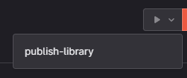

# React Shared Libraries

Usage of tehik scope packages:

- Add the following line to your `.npmrc`
  - `@tehik:registry=https://repo.tehik.ee/artifactory/api/npm/tehik-npm-release/`
- Afterwards follow the directions described in [here](https://repo.tehik.ee/ui/repos/tree/General/tehik-npm-release) under "Set Me Up"

Steps to use `@tehik/react-components` are described [here](https://star2-storybook.netlify.app/?path=/docs/documentation-usage--usage).

## Naming conventions

- interactive/click events are prefixed by `on`, for example `onClick`
- boolean values are prefixed by `is`, for example `isMenuVisible`

## Development

### Publishing

- PR'i mergemisel ehitatakse master branch
- Selle sammu juures on optional samm, mida maintainer rolliga inimesed saavad triggerdada
  
- publish-library jooksutamisel tekib uus versioon semantic-version abil, mis tekitab uue versiooni commit'ide põhjal

TODO:

- CI jobs
- Gitlab rules
- Commit rules (Breaking changes etc.)
- Who oversees changes, how is everything shared across projects
- Setting up storybook on a public? URL

- debugging
  - `npm run build`
  - `cd dist/packages/components && npm link`
  - In target project:
    - `npm link @tehik/react-components --save`

Future ideas:

- Publishing every component separately
- More tests
- ...
